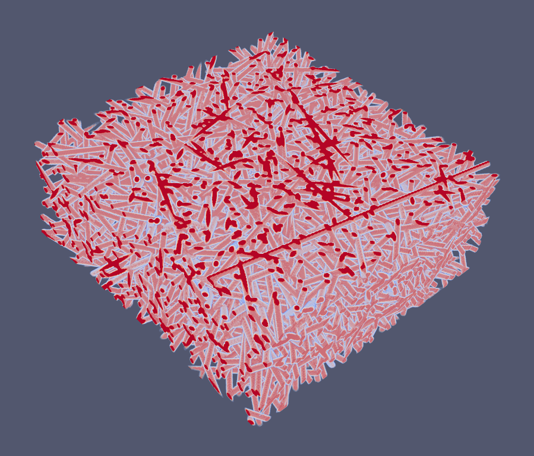

# Random_generationg

QSGS_old文件夹中是我编写的基础QSGS方法代码，之后会更新并加入整个大的程序软件框架当中

src为我新重构的随机生成结构的源码，将源码下载后在linux上用c++11 环境编译即可以使用
编译命令：g++ -std=c++11 main.cpp -o main

现阶段可实现：

可随机生成z轴依照各向异性参数变化的直筒随机纤维结构

现阶段无法改进：

纤维间是有重叠的，纤维无法弯曲

并行计算程序等我毕业后会更新，现阶段只能放单核的

现阶段程序的算法来源自一篇文章[doi:10.1016/j.commatsci.2006.01.018](doi:10.1016/j.commatsci.2006.01.018)

